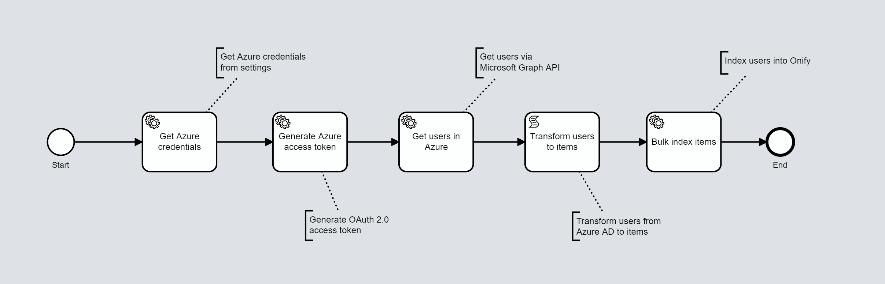

[](https://www.repostatus.org/#wip)

# Onify Blueprint: Indexing Users from Microsoft Azure via Microsoft Graph

Want to get information from Microsoft Azure into Onify. It is easy! By using Microsoft Graph API we can read/write from/to Azure. Here we show how we can index users from Azure AD and create items. All you need to do is create actions and processes to get the automation part working :)



## Requirements

* Onify Hub v2
* Onify Flow license
* Camunda Modeler 4.4 or later 
* Microsoft Azure (Office 365)

## Included

* 1 x Flows

## Setup

### Microsoft Azure

In order to index information from Microsoft Azure we need to setup a couple of things. 

1. Register your app (platform must be set to native (Mobile and desktop applications))
2. Configure permissions for Microsoft Graph (minimum `User.Read.All`)
3. Get administrator consent (via `https://login.microsoftonline.com/<TENANTID>/adminconsent?client_id=<CLIENTID>`)

> For more information about setting up Microsoft Graph/Azure API credentials, see https://docs.microsoft.com/en-us/graph/auth-v2-service.

### Settings

Add the following setting(s) to Onify.

_Replace `<TENANT>`, `<CLIENTID>` and `<CLIENTSECRET>` with correct values._

```json
{
  "key": "_azure_credentials",
  "name": "Microsoft Azure credentials",
  "value": "{\"tenant\":\"<TENANTID>\", \"client_id\":\"<CLIENTID>\", \"client_secret\":\"<CLIENTSECRET>\"}",
  "type": "object",
  "tag": [
    "azure",
    "credentials",
    "frontend"
  ],
  "category": "custom",
  "role": [
    "admin"
  ]
}
```

### Deploy

1. Open `index-users-from-azure.bpmn` in Camunda Modeler
2. Click `Deploy current diagram` and follow the steps

## Run 

To test and run the flow, click `Start current diagram`

## Support

* Community/forum: https://support.onify.co/discuss
* Documentation: https://support.onify.co/docs
* Support and SLA: https://support.onify.co/docs/get-support

## License

This project is licensed under the MIT License - see the [LICENSE](LICENSE) file for details.
